# readygo-mall-cloud 莱蒂购商城

#### 介绍
一个基于SpringCloud, SpringCloud alibaba的微服务商城系统，支持单商户，多商户。目前包含的功能有“系统管理”，“会员管理”，“商品管理”，“商户管理”，“物流管理”，“营销管理”，“商城管理”等，使用的技术有Java,SpringBoot,SpringCloud,SpringCloudAlibaba, mysql, redis, rabbitmq, seata, nacos, SpringCloud gateway, SpringCloud OAuth等

#### 软件架构

#### 使用说明
本地可以直接启动所有服务(可以使用idea services)，所需的中间件已经安装在云服务，启动前请将db文件夹下的数据库文件执行一遍，
由于服务器资源有限，性能也一般，建议大家自行安装所需要的软件环境，若使用自己的环境，请在启动前确保其已安装并在项目中修改配置信息，所需的软件环境有：
- jdk8
- mysql5.7(或以上版本)，
- redis5.0.3(或其他版本)，
- rabbitmq3.9.15(或其他版本)，
- seata1.4.0，
- nacos2.0.3

#### 前端项目（gitee）
- 后台管理端（运营管理端和商户端）：https://gitee.com/dongjuntao/readygo-mall-admin-vue
- 门户端（PC端网站）：https://gitee.com/dongjuntao/readygo-mall-portal-vue

#### 前端项目（github）
- 后台管理端（运营管理端和商户端）：https://github.com/dongjuntao/readygo-mall-admin-vue
- 门户端（PC端网站）：https://github.com/dongjuntao/readygo-mall-portal-vue

#### 管理端部分页面展示
- 会员管理
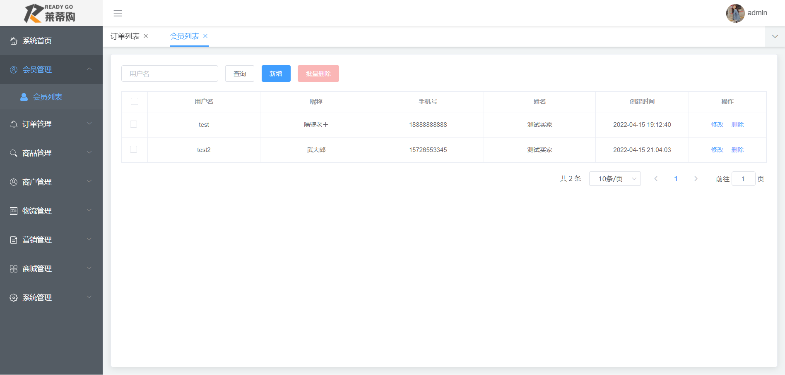
- 商品管理
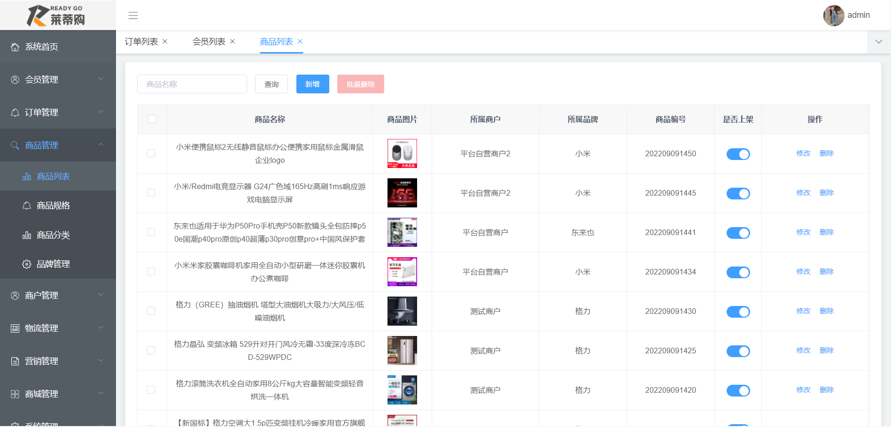
- 商品规格
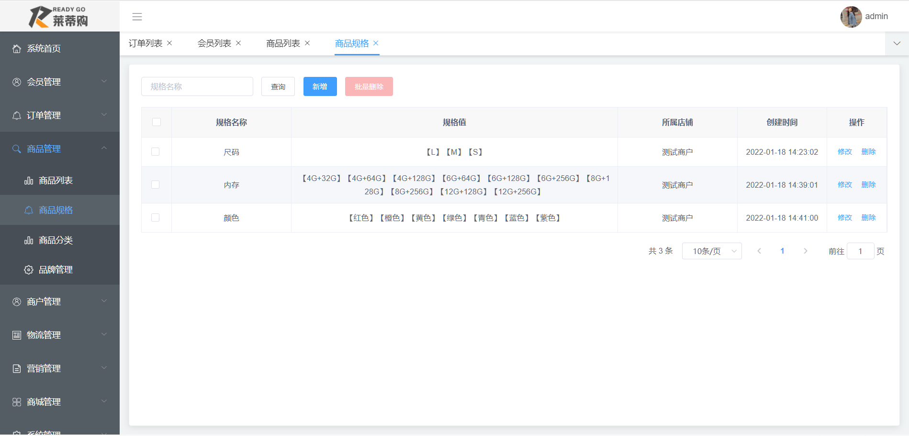
- 商品分类
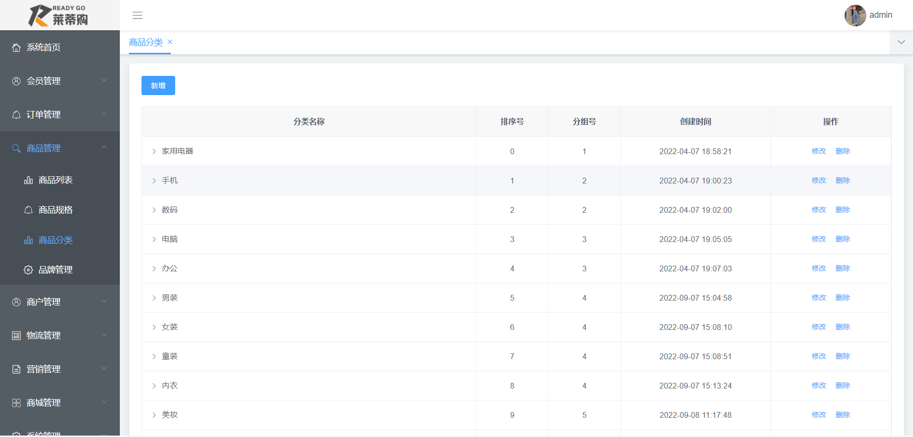
- 品牌管理
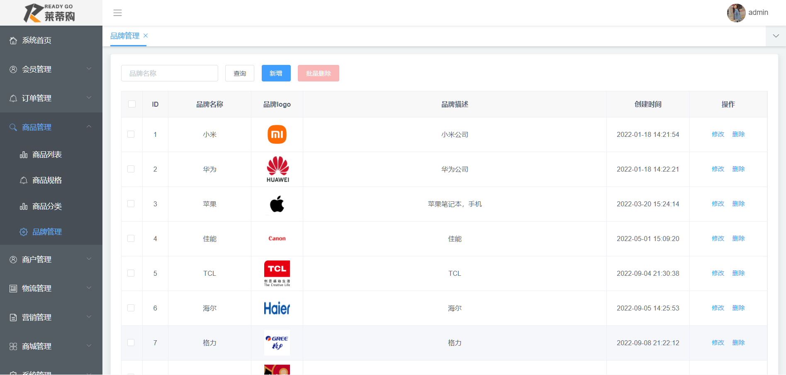
- 订单管理
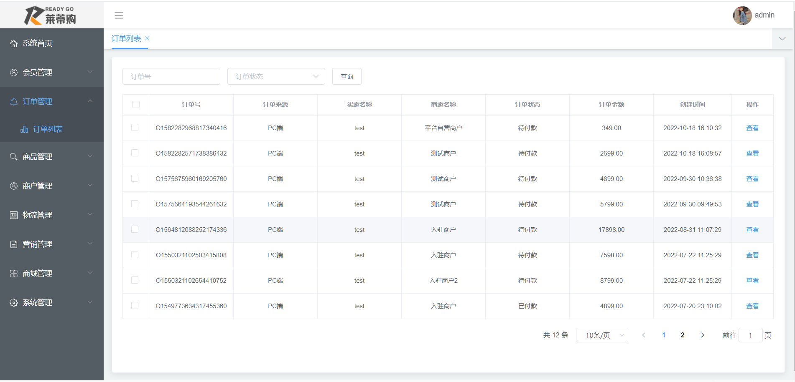
- 优惠券管理
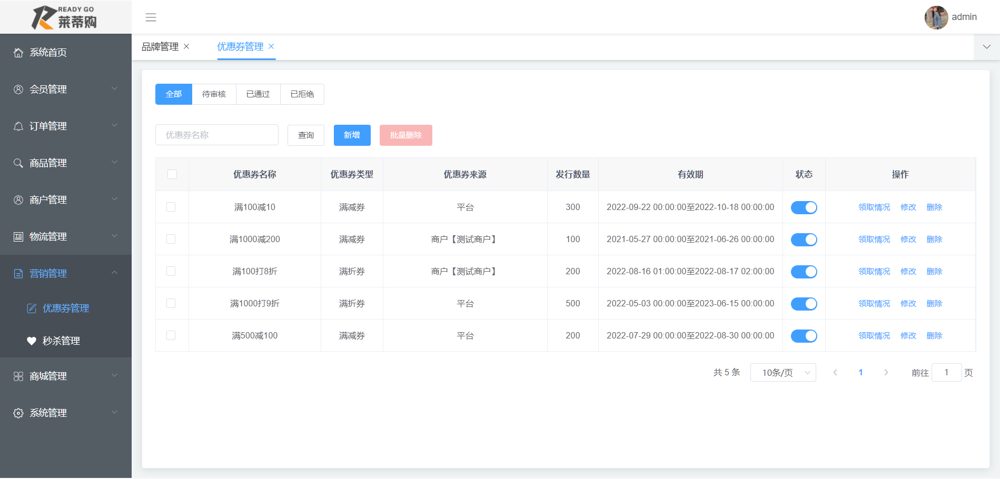
- 秒杀管理
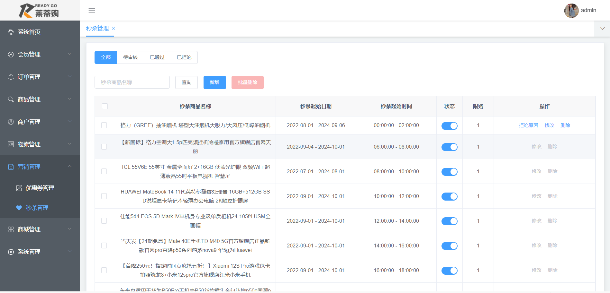

#### 门户端部分页面展示
- 门户首页
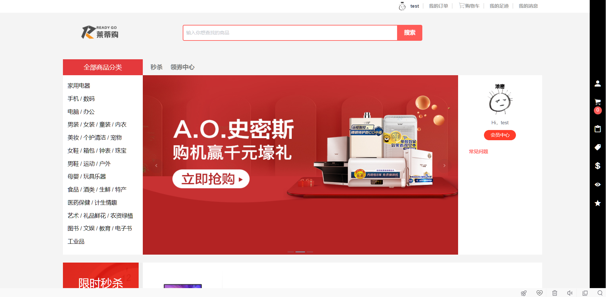
- 门户首页
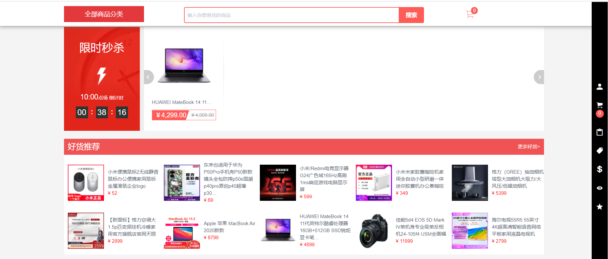
- 收货地址
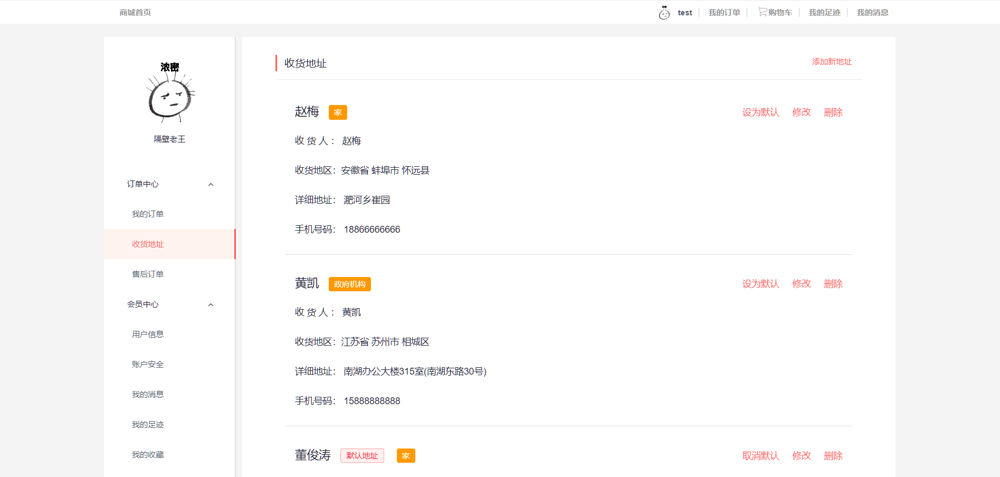
- 购物车
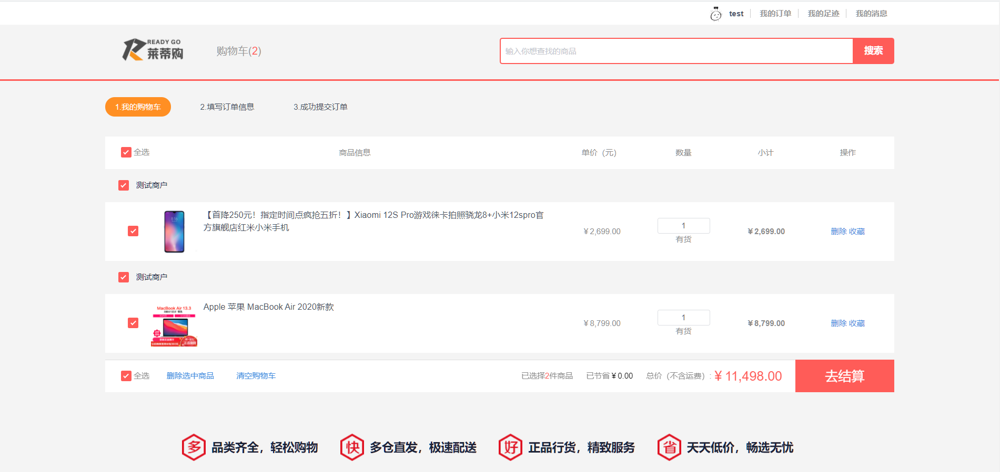
- 我的订单
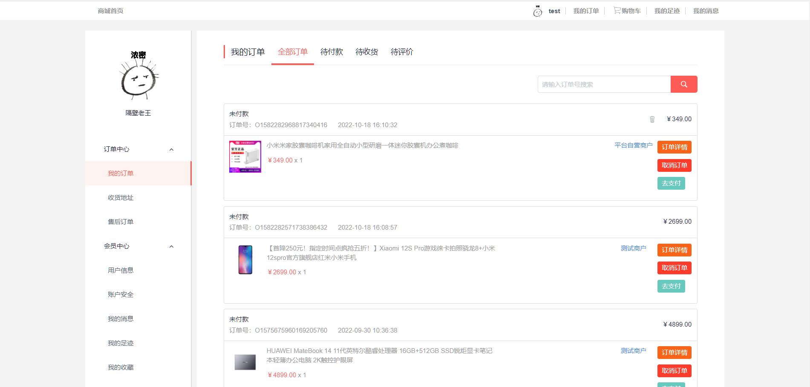
- 我的足迹
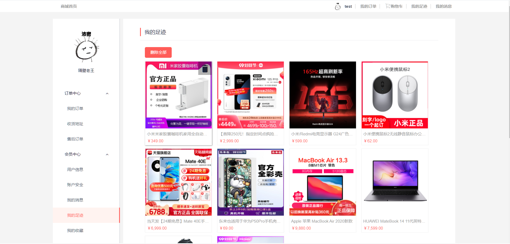
- 支付宝支付
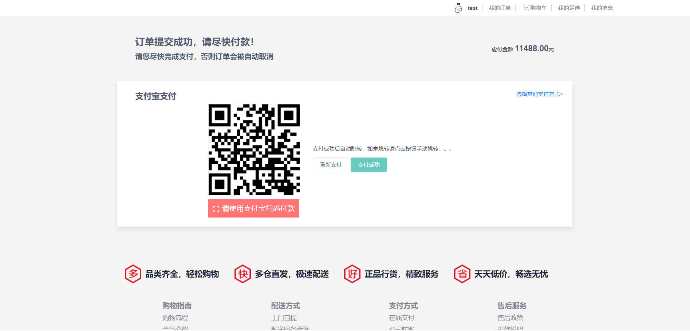
